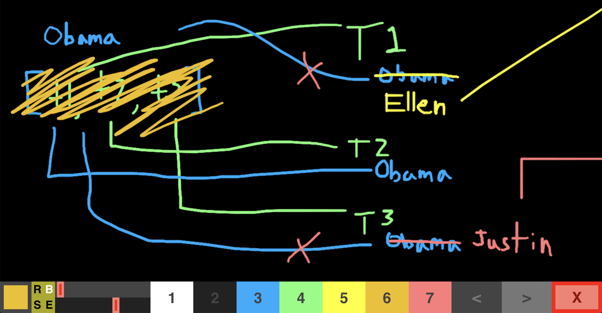
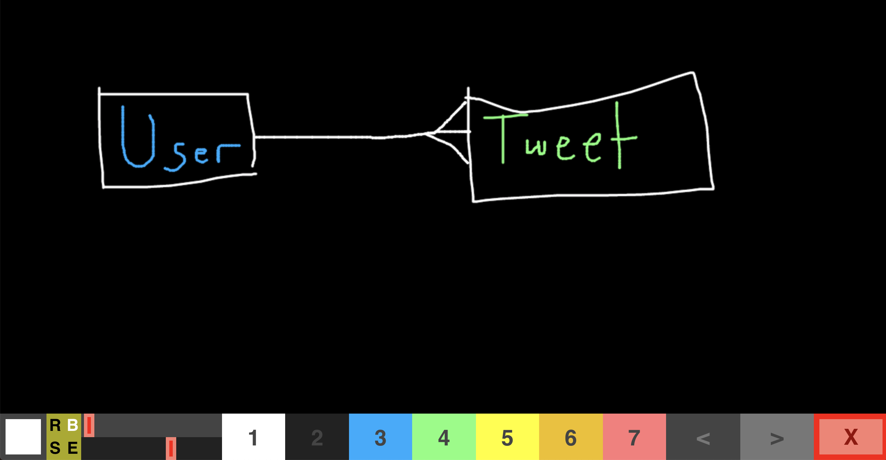

### Single Source of Truth
Obama should not keep an array of his tweets. The ownership of
tweets should come from a single source of truth. Delete the
array the Obama user used to hold. Now Obama find's his tweets
by iterating through all the tweets and finding one's that say
they're his.

Now tweet ownership exists in only one place: a single source
of truth. Without the array there's no conflict of truths.

### One-to-Many
A user may have many tweets. Each tweet has just one user.

